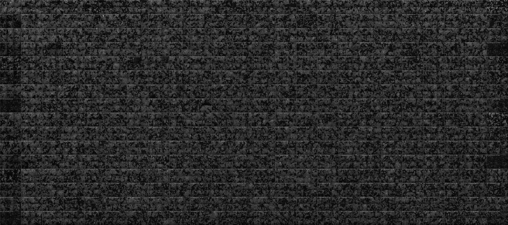
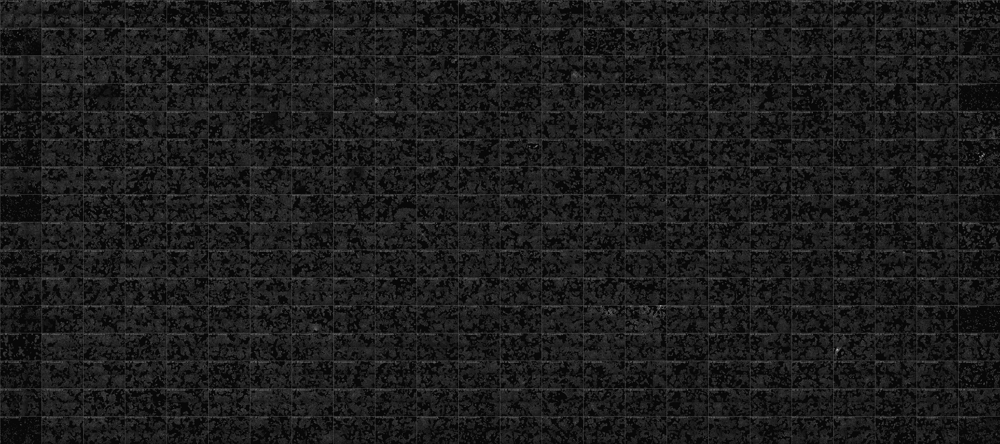
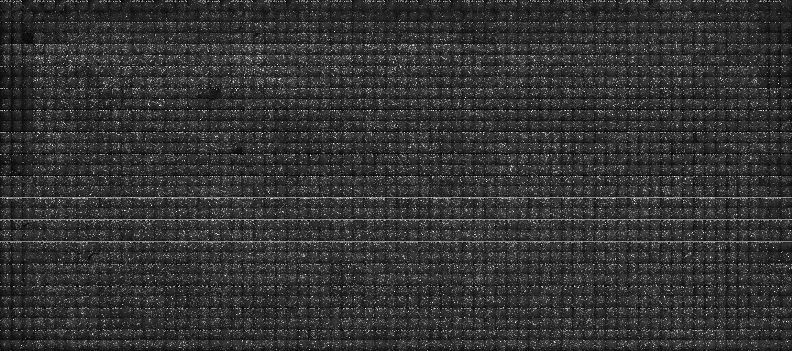
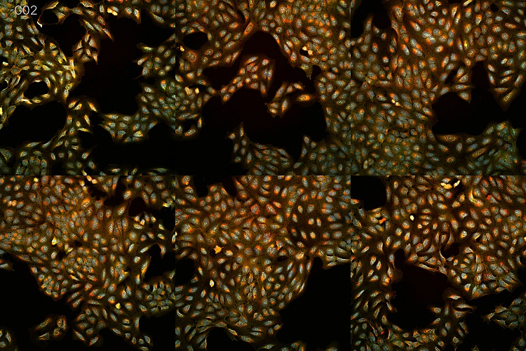

# Lumos

Lumos is a program that generates full-plate images from the separate site/field pictures obtained through the Cell Painting assay.

It has 2 operation modes that allow it to render images for specific channels of a plate, as well as colorful images that combine all channels together:

 

</br>

In this document, you will find information related to:
 * [The installation of the package](#installing-lumos)
 * [How to use Lumos](#usage)
 * [Detailed examples](#detailed-examples)

</br>

To learn more about the command-line interface of the program, refer to the [**Wiki pages**](https://github.com/nicolasboisseau/lumos/wiki).

You can also find instructions for developers in [this other documentation](./readme-dev.md).

</br>

## Installing Lumos

Prerequisites:
- You need to have Python 3.8 installed on a Windows or Linux machine.
- You also need to have the raw site images of your plates on your machine/mounted storage drive.

Then, **to install Lumos**, choose one of the following:
- Install Lumos using PIP with: 
  ```
  pip install lumos-cli
  ```
- Install Lumos from the source files:
  - Download the source files, either by downloading the ZIP file or cloning the repository.
  - Install the dependencies using PIP: ```pip install -r .\requirements.txt```
  - Install Lumos: ```python setup.py install```

</br>

## Usage

### Configuring Lumos

To configure Lumos to work with your specific plate formats, you must first create a configuration file. To do so, enter the command below:

```
lumos --generate-config-file ./my_config.yaml
```

Then, in the generated file, you should change the following entries to match the organization of your images:
- `path_from_run_folder_to_plates`
- `path_from_plate_folder_to_images`
- `input_file_naming_scheme`
- `well_grid`
- `site_grid`
- `image_dimensions`
  
Then, also make sure that you update the following items with the correct ID of your channels (i.e. how they appear in your file names):
- the keys/sub-entries of `channel_info`
- `default_channels_to_render`
- `brightfield_channels`
- `cp_channels_to_use`

You can view an example of this [**here**](#example-configuration-file).

Once this is done, you are ready to use Lumos on your images.

### Simple commands

A first command you can run is the following:
```
lumos --config-file ./my_config.yaml qc --scope plate --source-path <path_to_a_plate_folder> --output-path ./output/
```
where `<path_to_a_plate_folder>` is a path to the root folder of a plate. In [this example](#example-configuration-file), this would be one of the `PLATE-XXX` folders.

This will generate 1 greyscale image per channel of the plate (excluding brightfield channels) and allow you to check easily that the quality of the images that you have is good:

  
 

> #### Note:
> We could have also used argument aliases in order to make the command shorter, as follows:
> ```
> lumos -cf ./my_config.yaml qc -s plate -sp <path_to_a_plate_folder> -op ./output/
> ```
> To see a list of all available arguments and their aliases, use `lumos qc --help`.

This first command relied on the `qc`, or "**Quality Control**" mode of Lumos (hence the `qc` keyword present in the command). Similarly, Lumos also has a `cp`, or "**Cell Painting**" mode, that allows you to generate 1 combined image of all the channels of a plate (in color).

To use it, type the following in your terminal:
```
lumos -cf my_config.yaml cp --scope plate --source-path <path_to_a_plate_folder> --output-path ./output/
```

This will generate an image looking similar to this:

 (zooming in: )

> #### Note:
> To see a list of all available Cell Painting arguments and their aliases, use `lumos cp --help`.

In addition to those first examples, Lumos QC can also generate images for only a specific channel of a plate, or for a whole run (i.e. a collection of plates). And similarly, Lumos CP can generate separate images for each well of a plate, just for a single well, or even for each site of those wells.

This, as well as other functionalities of Lumos, can be chosen through the arguments used in your commands. To see a full list of the available arguments and options you have for each operation mode, type `lumos qc --help` and `lumos cp --help` respectively.

You can also explore some of our [more detailed examples](#detailed-examples) or refer to our [**Wiki pages**](https://github.com/nicolasboisseau/lumos/wiki) to learn more.

</br>
</br>

## Detailed examples

### Example configuration file

 If you had the following folder structure:
 ```
 JUMPCP_images/
     ├ run_1/
         └ plates/
             ├ PLATE-101/
               └ Images/
                   ├ r01c01f01p01-ch1sk1fk1fl1.tiff
                   ├ r01c01f01p01-ch2sk1fk1fl1.tiff
                   ├ ...
                   └ r32c48f04p01-ch8sk1fk1fl1.tiff
             ├ PLATE-102/
               └ Images/
                   ├ r01c01f01p01-ch1sk1fk1fl1.tiff
                   ├ r01c01f01p01-ch2sk1fk1fl1.tiff
                   ├ ...
                   └ r32c48f04p01-ch8sk1fk1fl1.tiff
             └ ...
     ├ run_2/
         └ plates/
             ├ PLATE-201/...
             ├ PLATE-202/...
             └ ...
     └ run_3/
         └ plates/
             ├ PLATE-301/...
             ├ PLATE-302/...
             └ ...
 ```
 
 with wells in a grid of 32 rows by 48 columns, sites in a grid of 2 by 2, and images of 1080 by 1080 pixels.
 
 You would edit the following entries in your configuration file as follows:
 ```yaml
 path_from_run_folder_to_plates: 'plates/'
 path_from_plate_folder_to_images: 'Images/'
 input_file_naming_scheme: rows_and_columns
 well_grid: 32x48
 site_grid: 2x2
 image_dimensions: 1080x1080
 channel_info:
   ch1: [...]
   ch2: [...]
   ch3: [...]
   ch4: [...]
   ch5: [...]
   ch6: [...]
   ch7: [...]
   ch8: [...]
 default_channels_to_render:
 - ch1
 - ch2
 - ch3
 - ch4
 - ch5
 brightfield_channels:
 - ch6
 - ch7
 - ch8
 cp_channels_to_use:
 - ch1
 - ch2
 - ch3
 - ch4
 - ch5
 ```

### Example 1: Generating the image of a specific channel of a plate

To do this, we can use the 'channel' scope with the additional `--channel` argument to select which channel should be rendered by specifying its channel ID. Assuming the above example configuration, to render the channel "ch3" of our plate, we would get:
```
lumos --config-file my_config.yaml qc --scope channel --channel ch3 --source-path <path_to_a_plate_folder> --output-path ./output/
```

And alternatively, using argument aliases, we can use the shorter following command:
```
lumos -cf my_config.yaml qc -s channel -c ch3 -sp <path_to_a_plate_folder> -op ./output/
```

### Example 2: Generating an image for all channels of a plate, including brightfields

To do this, we can add the `--brightfield` argument to our regular command. With this argument, we can either choose to include a specific Brightfield channel by writing its ID, or include all of them by writing 'all'. In this example, we will do the latter:
```
lumos --config-file my_config.yaml qc --scope plate --source-path <path_to_a_plate_folder> --output-path ./output/ --brightfield all
```

And alternatively, using argument aliases, we can use the shorter following command:
```
lumos -cf my_config.yaml qc -s plate -sp <path_to_a_plate_folder> -op ./output/ -b all
```

### Example 3: Generating images for all channels of multiple plates (i.e. a "run")

To do this, we can use the 'run' scope. Then, instead of putting a path to a plate as our `--source-path`, we put the path to our "run" (i.e. our collection of plate).

```
lumos --config-file my_config.yaml qc --scope run --source-path <path_to_a_run_folder> --output-path ./output/
```

> #### Note:
> Make sure that your configuration file contains the correct path to follow between your run folder to your plate folders in `path_from_run_folder_to_plates`

And alternatively, using argument aliases, we can use the shorter following command:
```
lumos -cf my_config.yaml qc -s run -sp <path_to_a_run_folder> -op ./output/
```

### Example 4: Generating the Cell Painted image of a specific well in a plate

This can be done using the 'wells' scope of the `cp` mode of Lumos. Then, we can restrict the generation of images to a single well using the `--single-well` argument followed by the well name (e.g. "r03c21"):

```
lumos --config-file my_config.yaml cp --scope wells --single-well r03c21 --source-path <path_to_a_plate_folder> --output-path ./output/
```

And alternatively, using argument aliases, we can use the shorter following command:
```
lumos -cf my_config.yaml cp -s wells -w r03c21 -sp <path_to_a_plate_folder> -op ./output/
```
